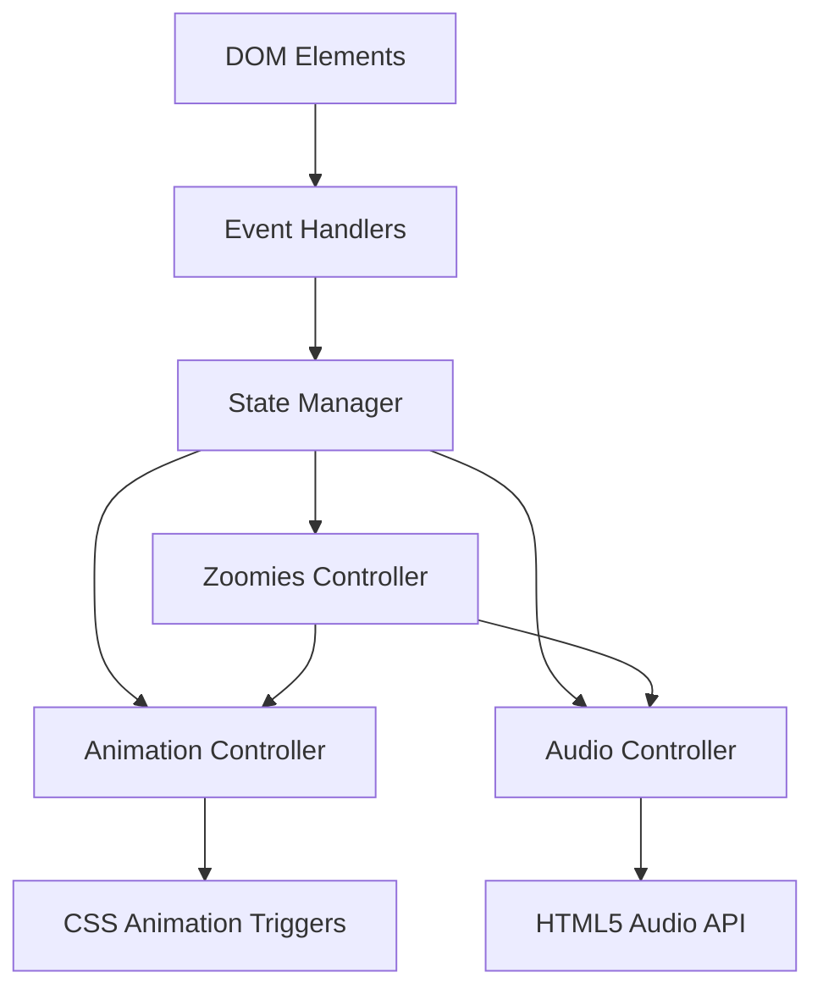

# Design Document: Sunflower Care App

## Overview

The Sunflower Care App is a single-page interactive web application that provides a playful, relaxing experience centered around caring for a virtual sunflower. The application combines SVG graphics, CSS animations, HTML5 audio, and vanilla JavaScript to create an engaging micro-interaction experience with cottagecore aesthetics.

The core interaction loop consists of:
1. User clicks the sunflower or water button
2. System responds with animations and sound effects
3. Care counter increments to track engagement
4. Occasional "zoomies" behavior adds delightful unpredictability

The entire application is self-contained in a single HTML file, using only CDN resources for Tailwind CSS and fonts, making deployment trivial and ensuring the app works offline after initial load.

## Architecture

### High-Level Architecture

The application follows a simple event-driven architecture with three main layers:

```
┌─────────────────────────────────────────┐
│         Presentation Layer              │
│  (HTML Structure + Tailwind Styling)    │
└─────────────────────────────────────────┘
                  ↓
┌─────────────────────────────────────────┐
│         Interaction Layer               │
│  (Event Handlers + State Management)    │
└─────────────────────────────────────────┘
                  ↓
┌─────────────────────────────────────────┐
│         Effects Layer                   │
│  (Animation System + Audio System)      │
└─────────────────────────────────────────┘
```

### Component Architecture

The application is organized into functional modules within a single JavaScript scope:



### Key Design Decisions

1. **Single-File Architecture**: All code in one HTML file simplifies deployment and eliminates build steps
2. **No Framework**: Vanilla JavaScript keeps the bundle size minimal and eliminates dependencies
3. **SVG Graphics**: Scalable vector graphics ensure crisp rendering at any screen size
4. **CSS Animations**: Hardware-accelerated CSS transforms provide smooth 60fps animations
5. **Data URLs for Audio**: Sound effects embedded as base64 data URLs eliminate external file dependencies
6. **Functional Programming Style**: Pure functions for state updates and side effects isolated to controllers

## Components and Interfaces

### 1. State Manager

**Responsibility**: Maintains application state and provides controlled state updates

**Interface**:
```javascript
const state = {
  careCount: 0,
  isAnimating: false
};

function incrementCareCount() {
  state.careCount++;
  updateCareCounterDisplay();
}

function setAnimating(value) {
  state.isAnimating = value;
}
```

**State Properties**:
- `careCount`: Number - Total interactions performed (clicks + waters)
- `isAnimating`: Boolean - Prevents overlapping animations

### 2. Animation Controller

**Responsibility**: Manages all visual animations and transitions

**Interface**:
```javascript
function triggerHappyAnimation(element) {
  // Adds 'wiggle' animation class
  // Removes class after animation completes
}

function triggerZoomiesAnimation(element) {
  // Adds 'fast-shake' animation class
  // Moves element to random position
  // Spawns speed line emojis
  // Cleans up after animation
}

function triggerWaterAnimation(element) {
  // Adds 'splash' and 'grow' animation classes
  // Removes classes after animation completes
}
```

**Animation Types**:
- `wiggle`: Rotation animation for happy reactions (±15deg, 0.5s)
- `fast-shake`: Rapid shake for zoomies (±20deg, 0.2s, 3 iterations)
- `float`: Continuous gentle vertical movement (±10px, 3s infinite)
- `splash`: Scale pulse for water effect (1.0 → 1.1 → 1.0, 0.4s)
- `grow`: Slight scale increase (1.0 → 1.05, 0.3s)
- `fade-out`: Opacity transition for emoji effects (1.0 → 0, 1s)

### 3. Audio Controller

**Responsibility**: Manages sound effect playback

**Interface**:
```javascript
function playPopSound() {
  // Creates/plays HTML5 Audio with pop sound data URL
}

function playZoomSound() {
  // Creates/plays HTML5 Audio with boing/zoom sound data URL
}
```

**Sound Effects**:
- Pop sound: Soft, pleasant click feedback (200-300ms duration)
- Zoom sound: Playful boing effect (300-500ms duration)

**Implementation Notes**:
- Use data URLs with base64-encoded audio (WAV or MP3)
- Create new Audio() instance for each play to allow overlapping sounds
- Set volume to 0.3-0.5 for non-intrusive feedback

### 4. Zoomies Controller

**Responsibility**: Handles random zoomies behavior trigger and execution

**Interface**:
```javascript
function shouldTriggerZoomies() {
  // Returns true with 10% probability
  return Math.random() < 0.1;
}

function executeZoomies(element) {
  // Triggers fast shake animation
  // Moves to random screen position
  // Spawns speed line emojis
  // Plays zoom sound
}

function getRandomPosition() {
  // Returns {x, y} coordinates within viewport bounds
  // Ensures sunflower stays visible (20% margin from edges)
}
```

### 5. Event Handler Module

**Responsibility**: Connects user interactions to application logic

**Interface**:
```javascript
function handleSunflowerClick(event) {
  if (state.isAnimating) return;
  
  setAnimating(true);
  incrementCareCount();
  
  if (shouldTriggerZoomies()) {
    executeZoomies(sunflowerElement);
  } else {
    triggerHappyAnimation(sunflowerElement);
    playPopSound();
  }
  
  setTimeout(() => setAnimating(false), 1000);
}

function handleWaterClick(event) {
  if (state.isAnimating) return;
  
  setAnimating(true);
  incrementCareCount();
  triggerWaterAnimation(sunflowerElement);
  playPopSound();
  
  setTimeout(() => setAnimating(false), 1000);
}
```

### 6. UI Renderer

**Responsibility**: Updates DOM to reflect state changes

**Interface**:
```javascript
function updateCareCounterDisplay() {
  // Updates care counter text content
  document.getElementById('care-counter').textContent = 
    `Total Care: ${state.careCount}`;
}

function spawnSpeedLineEmoji(x, y) {
  // Creates emoji element at position
  // Adds fade-out animation
  // Removes from DOM after animation
}
```

## Data Models

### Application State

```javascript
{
  careCount: Number,      // Range: 0 to Infinity
  isAnimating: Boolean    // Prevents concurrent animations
}
```

**Invariants**:
- `careCount >= 0` (always non-negative)
- `isAnimating` is true only during animation execution

### Position Coordinates

```javascript
{
  x: Number,  // Pixels from left edge, range: [viewport.width * 0.2, viewport.width * 0.8]
  y: Number   // Pixels from top edge, range: [viewport.height * 0.2, viewport.height * 0.8]
}
```

**Invariants**:
- Coordinates keep sunflower within visible viewport
- 20% margin from edges prevents clipping

### Animation State

```javascript
{
  name: String,           // One of: 'wiggle', 'fast-shake', 'splash', 'grow', 'float'
  duration: Number,       // Milliseconds
  element: HTMLElement    // Target DOM element
}
```

### Audio Configuration

```javascript
{
  src: String,    // Data URL with base64-encoded audio
  volume: Number  // Range: 0.0 to 1.0
}
```


## Correctness Properties

*A property is a characteristic or behavior that should hold true across all valid executions of a system—essentially, a formal statement about what the system should do. Properties serve as the bridge between human-readable specifications and machine-verifiable correctness guarantees.*

### Property 1: Sunflower Click Triggers Complete Reaction

*For any* application state where the sunflower is not currently animating, when the user clicks the sunflower (and zoomies are not triggered), the system should add a wiggle animation class to the sunflower element, play a pop sound, and increment the care counter by exactly 1.

**Validates: Requirements 3.1, 3.2, 3.3**

### Property 2: Water Button Triggers Complete Water Action

*For any* application state where the sunflower is not currently animating, when the user clicks the water button, the system should add splash and grow animation classes to the sunflower element, play a pop sound, and increment the care counter by exactly 1.

**Validates: Requirements 5.2, 5.3, 5.4, 5.5**

### Property 3: Zoomies Probability Threshold

*For any* sunflower click event, when Math.random() returns a value less than 0.1, the system should trigger zoomies behavior instead of the normal click reaction.

**Validates: Requirements 4.1**

### Property 4: Zoomies Triggers Complete Behavior

*For any* application state where zoomies are triggered, the system should add a fast-shake animation class to the sunflower element, move the sunflower to a new random position within viewport bounds, spawn speed line emoji elements near the sunflower, play a zoom sound, and ensure the emoji elements fade out and are removed from the DOM.

**Validates: Requirements 4.2, 4.3, 4.4, 4.5, 4.6**

### Property 5: Care Counter Display Synchronization

*For any* interaction (click or water), immediately after the interaction completes, the displayed care counter text should match the internal state.careCount value.

**Validates: Requirements 6.3**

### Property 6: Care Counter Accumulation

*For any* sequence of interactions, the care counter should equal the total number of interactions performed, maintaining its value throughout the session without reset.

**Validates: Requirements 6.4, 6.2**

### Property 7: Random Position Bounds

*For any* random position generated for zoomies, the x-coordinate should be between 20% and 80% of viewport width, and the y-coordinate should be between 20% and 80% of viewport height, ensuring the sunflower remains fully visible.

**Validates: Requirements 4.3**

### Property 8: Animation State Prevents Concurrent Interactions

*For any* interaction attempt while isAnimating is true, the system should ignore the interaction and not increment the care counter or trigger any animations or sounds.

**Validates: Requirements 3.1, 5.2 (implicit requirement for preventing animation overlap)**

## Error Handling

### User Input Errors

**Rapid Clicking**:
- Problem: User clicks multiple times in rapid succession
- Handling: The `isAnimating` flag prevents concurrent animations. Clicks during animation are silently ignored.
- User Feedback: No error message needed; this is expected behavior

**Clicking During Zoomies**:
- Problem: User clicks while sunflower is moving to random position
- Handling: Animation lock prevents new interactions until zoomies complete
- User Feedback: Visual feedback (sunflower is clearly animating) indicates system is busy

### Audio Errors

**Audio Playback Failure**:
- Problem: Browser blocks autoplay or audio file fails to load
- Handling: Wrap audio.play() in try-catch block, log error to console, continue without sound
- User Feedback: Application continues to function; visual feedback remains intact
- Code example:
```javascript
function playSound(audioDataUrl) {
  try {
    const audio = new Audio(audioDataUrl);
    audio.volume = 0.4;
    audio.play().catch(err => console.warn('Audio playback failed:', err));
  } catch (err) {
    console.warn('Audio creation failed:', err);
  }
}
```

**Missing Audio Data**:
- Problem: Data URL is malformed or empty
- Handling: Audio constructor will fail gracefully, caught by try-catch
- User Feedback: Silent failure; application continues normally

### Animation Errors

**Missing Animation Class**:
- Problem: CSS animation class is not defined
- Handling: Element will not animate but will remain visible and functional
- User Feedback: Interaction still increments counter and plays sound
- Prevention: Include all animation @keyframes in embedded CSS

**Position Calculation Overflow**:
- Problem: Viewport dimensions return invalid values
- Handling: Clamp position values to safe defaults (50% viewport width/height)
- Code example:
```javascript
function getRandomPosition() {
  const vw = window.innerWidth || 800;
  const vh = window.innerHeight || 600;
  return {
    x: Math.max(vw * 0.2, Math.min(vw * 0.8, vw * (0.2 + Math.random() * 0.6))),
    y: Math.max(vh * 0.2, Math.min(vh * 0.8, vh * (0.2 + Math.random() * 0.6)))
  };
}
```

### DOM Errors

**Element Not Found**:
- Problem: getElementById returns null if element doesn't exist
- Handling: Check for null before adding event listeners or manipulating elements
- User Feedback: Log error to console for debugging
- Code example:
```javascript
function initializeApp() {
  const sunflower = document.getElementById('sunflower');
  const waterBtn = document.getElementById('water-btn');
  
  if (!sunflower || !waterBtn) {
    console.error('Required elements not found');
    return;
  }
  
  // Proceed with initialization
}
```

**Emoji Cleanup Failure**:
- Problem: Speed line emoji elements fail to remove from DOM
- Handling: Use setTimeout with removeChild in try-catch
- Impact: Minor memory leak if many zoomies occur, but negligible for typical usage

### Browser Compatibility Errors

**CSS Feature Not Supported**:
- Problem: Older browser doesn't support backdrop-filter
- Handling: Provide fallback styles without glassmorphism
- Code example:
```css
.glass-button {
  background: rgba(255, 255, 255, 0.3);
  backdrop-filter: blur(10px);
  /* Fallback for browsers without backdrop-filter */
  background: rgba(255, 255, 255, 0.6);
}
```

**ES6 Features Not Supported**:
- Problem: Browser doesn't support arrow functions or const/let
- Handling: Target only browsers specified in Requirement 10 (Chrome 90+, Firefox 88+, Safari 14+, Edge 90+)
- Prevention: All targeted browsers support ES6+

### State Consistency Errors

**Counter Overflow**:
- Problem: careCount exceeds Number.MAX_SAFE_INTEGER (9,007,199,254,740,991)
- Handling: Extremely unlikely in normal usage; no special handling needed
- Impact: Counter would become inaccurate only after ~9 quadrillion interactions

**Animation State Stuck**:
- Problem: isAnimating flag remains true due to error in animation completion
- Handling: Always use setTimeout to reset flag, even if animation fails
- Code example:
```javascript
function handleInteraction() {
  if (state.isAnimating) return;
  
  state.isAnimating = true;
  
  try {
    // Perform animation
  } catch (err) {
    console.error('Animation error:', err);
  } finally {
    setTimeout(() => state.isAnimating = false, 1000);
  }
}
```

## Testing Strategy

### Overview

The testing strategy employs a dual approach combining unit tests for specific examples and edge cases with property-based tests for universal behavioral properties. This ensures both concrete correctness and comprehensive input coverage.

### Unit Testing

**Framework**: Jest (or Vitest for faster execution)

**Test Categories**:

1. **DOM Structure Tests** (Examples from Requirements 1, 2, 5, 6, 8):
   - Verify single-file structure with all code embedded
   - Verify Tailwind CSS CDN link present in head
   - Verify font CDN link present
   - Verify no external script/style files (except CDNs)
   - Verify background gradient colors (#FFF7AE to #C8FACC)
   - Verify SVG element colors match specification
   - Verify water button exists with correct label
   - Verify care counter displays "Total Care: 0" on load
   - Verify glassmorphism classes present on UI elements
   - Verify animation @keyframes defined (wiggle, fast-shake, float, fade-out)

2. **State Management Tests**:
   - Initial state has careCount = 0 and isAnimating = false
   - incrementCareCount increases careCount by 1
   - setAnimating updates isAnimating flag
   - State persists across multiple interactions

3. **Event Handler Tests**:
   - Click on sunflower calls handleSunflowerClick
   - Click on water button calls handleWaterClick
   - Interactions blocked when isAnimating is true
   - Event handlers update state correctly

4. **Edge Cases**:
   - Rapid clicking (multiple clicks within 100ms)
   - Clicking during zoomies animation
   - Audio playback failure (mock Audio API to throw error)
   - Missing DOM elements (getElementById returns null)
   - Viewport dimensions at minimum size (320x568)
   - Viewport dimensions at maximum size (3840x2160)

**Example Unit Test**:
```javascript
describe('Sunflower Care App - DOM Structure', () => {
  test('should have water button with correct label', () => {
    document.body.innerHTML = `<button id="water-btn">Water Plant 💧</button>`;
    const btn = document.getElementById('water-btn');
    expect(btn).toBeTruthy();
    expect(btn.textContent).toBe('Water Plant 💧');
  });
  
  test('should display initial care counter', () => {
    document.body.innerHTML = `<div id="care-counter">Total Care: 0</div>`;
    const counter = document.getElementById('care-counter');
    expect(counter.textContent).toBe('Total Care: 0');
  });
});
```

### Property-Based Testing

**Framework**: fast-check (JavaScript property-based testing library)

**Configuration**: Minimum 100 iterations per property test

**Property Tests**:

1. **Property 1: Sunflower Click Triggers Complete Reaction**
   - **Feature: sunflower-care-app, Property 1**: For any application state where the sunflower is not currently animating, when the user clicks the sunflower (and zoomies are not triggered), the system should add a wiggle animation class to the sunflower element, play a pop sound, and increment the care counter by exactly 1.
   - Generator: Arbitrary initial careCount (0-1000), mock Math.random to return > 0.1
   - Assertion: After click, careCount increases by 1, wiggle class added, audio.play() called once

2. **Property 2: Water Button Triggers Complete Water Action**
   - **Feature: sunflower-care-app, Property 2**: For any application state where the sunflower is not currently animating, when the user clicks the water button, the system should add splash and grow animation classes to the sunflower element, play a pop sound, and increment the care counter by exactly 1.
   - Generator: Arbitrary initial careCount (0-1000)
   - Assertion: After click, careCount increases by 1, splash and grow classes added, audio.play() called once

3. **Property 3: Zoomies Probability Threshold**
   - **Feature: sunflower-care-app, Property 3**: For any sunflower click event, when Math.random() returns a value less than 0.1, the system should trigger zoomies behavior instead of the normal click reaction.
   - Generator: Arbitrary random values (0.0-1.0)
   - Assertion: When random < 0.1, zoomies triggered; when random >= 0.1, normal click reaction

4. **Property 4: Zoomies Triggers Complete Behavior**
   - **Feature: sunflower-care-app, Property 4**: For any application state where zoomies are triggered, the system should add a fast-shake animation class to the sunflower element, move the sunflower to a new random position within viewport bounds, spawn speed line emoji elements near the sunflower, play a zoom sound, and ensure the emoji elements fade out and are removed from the DOM.
   - Generator: Arbitrary viewport dimensions (320-3840 width, 568-2160 height)
   - Assertion: fast-shake class added, position changed, emoji elements created, zoom audio played, emojis removed after timeout

5. **Property 5: Care Counter Display Synchronization**
   - **Feature: sunflower-care-app, Property 5**: For any interaction (click or water), immediately after the interaction completes, the displayed care counter text should match the internal state.careCount value.
   - Generator: Arbitrary sequence of interactions (clicks and waters)
   - Assertion: After each interaction, DOM text content equals state.careCount

6. **Property 6: Care Counter Accumulation**
   - **Feature: sunflower-care-app, Property 6**: For any sequence of interactions, the care counter should equal the total number of interactions performed, maintaining its value throughout the session without reset.
   - Generator: Arbitrary array of interactions (length 1-100)
   - Assertion: Final careCount equals array length

7. **Property 7: Random Position Bounds**
   - **Feature: sunflower-care-app, Property 7**: For any random position generated for zoomies, the x-coordinate should be between 20% and 80% of viewport width, and the y-coordinate should be between 20% and 80% of viewport height, ensuring the sunflower remains fully visible.
   - Generator: Arbitrary viewport dimensions (320-3840 width, 568-2160 height)
   - Assertion: Generated x in [vw*0.2, vw*0.8], y in [vh*0.2, vh*0.8]

8. **Property 8: Animation State Prevents Concurrent Interactions**
   - **Feature: sunflower-care-app, Property 8**: For any interaction attempt while isAnimating is true, the system should ignore the interaction and not increment the care counter or trigger any animations or sounds.
   - Generator: Arbitrary initial careCount, isAnimating = true
   - Assertion: After interaction attempt, careCount unchanged, no animations triggered, no audio played

**Example Property Test**:
```javascript
const fc = require('fast-check');

describe('Sunflower Care App - Properties', () => {
  test('Property 6: Care counter accumulates correctly', () => {
    fc.assert(
      fc.property(
        fc.array(fc.constantFrom('click', 'water'), { minLength: 1, maxLength: 100 }),
        (interactions) => {
          // Feature: sunflower-care-app, Property 6
          const state = { careCount: 0, isAnimating: false };
          
          interactions.forEach(interaction => {
            state.careCount++;
          });
          
          expect(state.careCount).toBe(interactions.length);
        }
      ),
      { numRuns: 100 }
    );
  });
  
  test('Property 7: Random positions stay within bounds', () => {
    fc.assert(
      fc.property(
        fc.integer({ min: 320, max: 3840 }),
        fc.integer({ min: 568, max: 2160 }),
        (viewportWidth, viewportHeight) => {
          // Feature: sunflower-care-app, Property 7
          const pos = getRandomPosition(viewportWidth, viewportHeight);
          
          expect(pos.x).toBeGreaterThanOrEqual(viewportWidth * 0.2);
          expect(pos.x).toBeLessThanOrEqual(viewportWidth * 0.8);
          expect(pos.y).toBeGreaterThanOrEqual(viewportHeight * 0.2);
          expect(pos.y).toBeLessThanOrEqual(viewportHeight * 0.8);
        }
      ),
      { numRuns: 100 }
    );
  });
});
```

### Integration Testing

**Manual Testing Checklist**:
- Load application in Chrome 90+, Firefox 88+, Safari 14+, Edge 90+
- Verify visual appearance matches cottagecore aesthetic
- Test all interactions (click sunflower, click water button)
- Verify audio plays (may require user gesture in some browsers)
- Test on mobile viewport (320x568) and desktop (1920x1080)
- Verify animations are smooth (60fps)
- Test rapid clicking behavior
- Wait for zoomies to occur naturally (may take 10-20 clicks)
- Verify accessibility (keyboard navigation, screen reader compatibility)

### Performance Testing

**Metrics to Monitor**:
- Animation frame rate (target: 60fps)
- Audio playback latency (target: <100ms)
- Interaction response time (target: <50ms)
- Memory usage during extended session (target: <50MB)

**Tools**:
- Chrome DevTools Performance panel
- Lighthouse performance audit
- Manual testing with 1000+ interactions

### Test Coverage Goals

- Unit test coverage: >80% of JavaScript functions
- Property test coverage: 100% of correctness properties
- Browser compatibility: Manual testing in all 4 target browsers
- Edge case coverage: All identified error conditions tested

